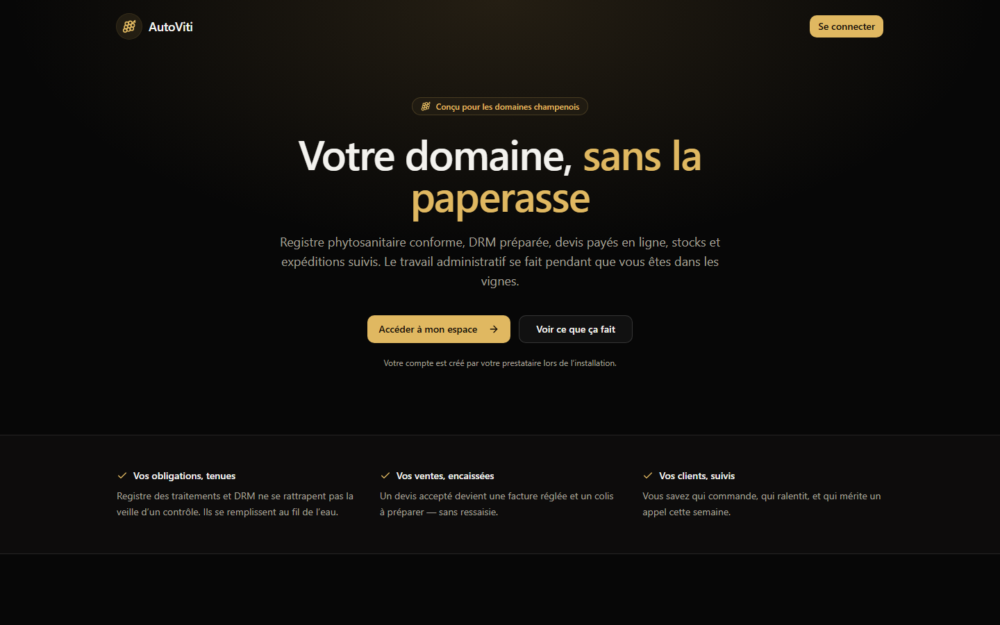
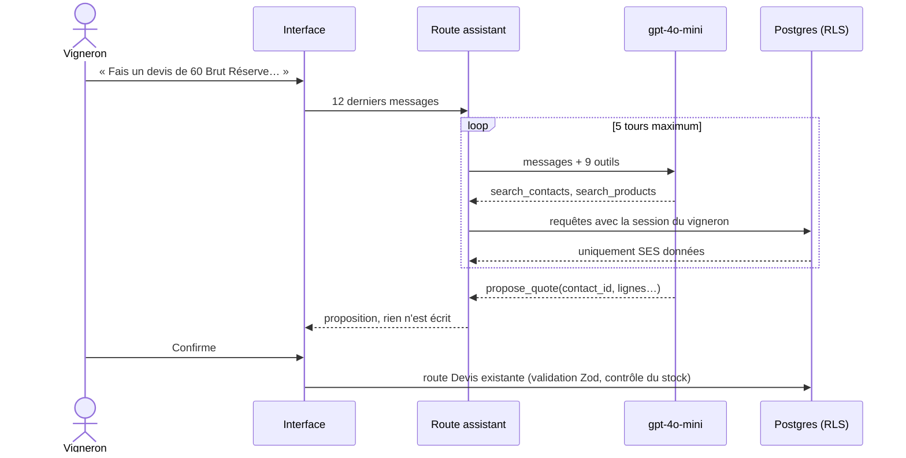
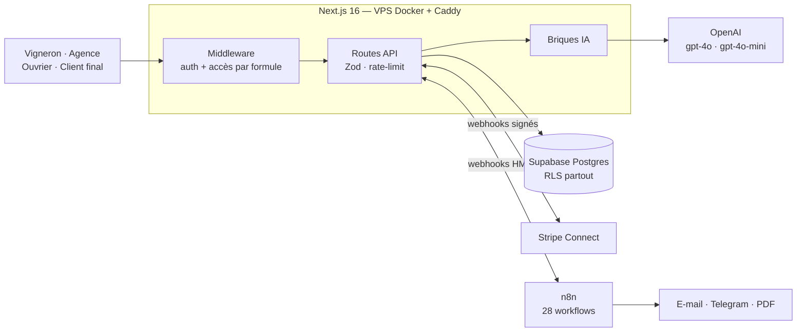
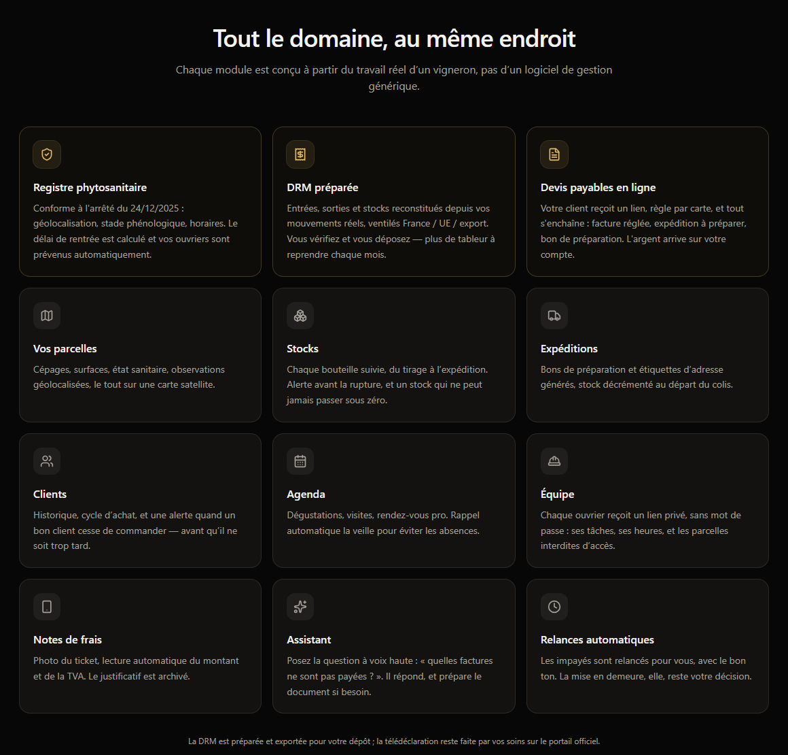

# AutoViti

**SaaS d'automatisation par l'IA pour les domaines viticoles de Champagne, en production.**

Un vigneron passe ses journées dans les vignes, et ses soirées dans la paperasse :
registre phytosanitaire, déclaration douanière mensuelle, devis, relances, stocks.
AutoViti fait ce travail à sa place. Il parle à un assistant, photographie ses tickets,
et les automatismes tournent pendant qu'il travaille.

Le produit a deux faces : l'**espace vigneron**, où le domaine est piloté au
quotidien, et l'**espace agence**, où se gèrent les clients, les workflows, la
facturation et la rentabilité.

| | |
|---|---|
| ~46 000 lignes de TypeScript | ~100 routes API |
| 36 migrations SQL, RLS sur toutes les tables | 28 workflows n8n |
| 65 tests automatisés | Déployé sur VPS (Docker + Caddy), supervisé par Sentry |

> **Pourquoi le code n'est pas public ?** AutoViti est un produit commercial utilisé
> par de vrais domaines. Le dépôt principal reste privé. Celui-ci présente
> l'architecture, les choix techniques et des [extraits de code](code/) tels qu'ils
> tournent en production. Je fais volontiers une visite du code complet en entretien.

---

## Les briques IA

### 1. Un assistant métier qui agit, sous contrôle humain

Le vigneron écrit ou dicte : *« Fais un devis de 60 Brut Réserve pour le Bistrot du
Port »*. L'assistant retrouve le client, lit le vrai prix et le stock de la cuvée,
puis prépare le devis. **Rien n'est créé tant que le vigneron n'a pas confirmé.**

Choix de conception :

- **Lire et agir sont séparés.** Les 5 outils de lecture s'exécutent côté serveur.
  Les 4 outils `propose_*` ne s'exécutent **jamais** : ils reviennent à l'interface
  sous forme de carte à confirmer. Une fois confirmée, l'action passe par les mêmes
  routes API qu'un formulaire, avec la même validation.
- **Isolation par construction.** Les outils interrogent la base avec la session du
  vigneron. La Row Level Security limite donc chaque requête à ses données. Même un
  modèle manipulé par une injection de prompt ne peut pas lire les données d'un
  autre client.
- **Pas d'ID ni de prix inventés.** Le prompt impose de passer par les outils de
  recherche pour obtenir les vrais identifiants et prix du catalogue. La carte de
  confirmation affiche chaque ligne avant création, et le serveur recalcule tous
  les totaux au lieu de faire confiance au modèle.
- **Borné en coût et en contexte.** Au plus 5 tours d'outils par requête, un
  historique tronqué à 12 messages, des sorties d'outils tronquées et un plafond
  de 20 requêtes par minute et par utilisateur, parce que chaque appel est facturé.
- Saisie vocale par la Web Speech API : le vigneron a souvent les mains prises.

→ [`code/assistant-route.ts`](code/assistant-route.ts)

### 2. Lecture des justificatifs par vision (GPT-4o)

Une photo de ticket ou un PDF de facture devient une note de frais pré-remplie :
commerçant, date, montant TTC, TVA, catégorie, moyen de paiement.

- **Sortie structurée** : mode JSON, température 0, catégorie ramenée de force dans
  une liste fermée.
- **Un humain valide toujours.** La route n'enregistre rien : elle pré-remplit un
  formulaire que le vigneron vérifie.
- **Dégradation propre** : si le ticket est illisible, si l'API ne répond pas ou si
  la réponse est inexploitable, le vigneron reçoit un message clair et passe à la
  saisie manuelle.
- Taille et types de fichiers contrôlés, et un plafond d'appels par utilisateur.

→ [`code/receipt-ocr-route.ts`](code/receipt-ocr-route.ts)

### 3. Rédaction de posts pour les réseaux sociaux

À partir d'un brief de deux lignes, l'IA propose un post au ton du domaine. Le
texte reste neutre quand il part sur plusieurs réseaux à la fois. Le vigneron relit
et corrige : la génération ne publie jamais rien d'elle-même.

→ [`code/generate-post-route.ts`](code/generate-post-route.ts)

### 4. Orchestration avec n8n

28 workflows : envoi des devis, relances d'impayés, rappels quotidiens, alertes de
sécurité aux ouvriers, rapports, synchronisation ERP. Le principe tient en une
ligne : **n8n donne le top, la logique métier reste dans le code TypeScript
testé.** Les deux côtés communiquent par des webhooks signés (HMAC-SHA256), avec des
traitements idempotents pour pouvoir être rejoués sans risque.

---

## Architecture

## Ingénierie de production

Ce qui sépare une démo d'un produit sur lequel des gens comptent :

- **Sécurité multi-clients.** RLS sur chaque table, contrôles d'accès revérifiés
  dans chaque route API (pas seulement dans le middleware). Un audit m'a fait
  trouver une faille : une policy sans restriction de colonne aurait permis à un
  client de se promouvoir administrateur en appelant directement l'API de la base.
  Je l'ai fermée par un trigger de garde, puis testée en conditions réelles.
- **Intégrité financière.** Numérotation des factures transactionnelle (jamais de
  doublon) et stock qui ne peut pas devenir négatif (verrou de ligne + contrainte).
  Les montants payés en ligne sont toujours lus en base, jamais depuis la requête.
  Les webhooks Stripe sont idempotents, car Stripe rejoue ses événements.
- **Paiements sans intermédiation.** Stripe Connect Standard : chaque vigneron
  encaisse sur son propre compte, l'agence ne détient jamais les fonds. Ce choix
  évite un statut réglementé.
- **Conformité.** Le registre phytosanitaire respecte l'arrêté du 24/12/2025.
  Les valeurs sont figées à l'enregistrement pour l'archive légale de 5 ans.
  Il y a un export RGPD, et Sentry est configuré pour ne remonter aucune donnée
  personnelle.
- **Tests là où une erreur coûte cher.** Les 65 tests Vitest couvrent l'argent, les
  droits d'accès et la sécurité. Je les ai vérifiés par mutation : casser une règle
  fait bien tomber les tests.

## Incidents et leçons

**« Tout répondait 200. »** Les automatisations planifiées ne tournaient pour aucun
client, alors que chaque appel d'onboarding renvoyait un succès. La cause : une
fonction SQL plantait à chaque exécution (un alias qui nommait la table au lieu de
la colonne). Le webhook n8n, lui, répondait 200 sans attendre le résultat.
*Leçon : un succès HTTP n'est pas un succès métier.* J'ai déplacé la logique en
TypeScript testé et ajouté une supervision qui lit les exécutions réelles de n8n
(28 workflows, 421 exécutions analysées).

**Des paiements confirmés mais jamais enregistrés.** Pendant environ 24 h, Stripe
encaissait mais l'application rejetait 100 % des événements : la clé de signature
du webhook des comptes connectés n'avait jamais été copiée sur le serveur. Je l'ai
diagnostiqué sans jamais afficher de secret, en interrogeant Stripe depuis le
conteneur avec la clé déjà en place. *Leçon : chaque variable d'environnement est
documentée dans un modèle versionné, et chaque webhook a son taux d'erreur
surveillé.*

## Stack

**Application** : Next.js 16 (App Router), TypeScript strict, React, TanStack Query,
Tailwind CSS, Radix UI, Zod, Recharts, Leaflet
**Données** : Supabase (PostgreSQL, Auth, Storage, Row Level Security)
**IA** : OpenAI (function calling, vision, sorties JSON)
**Automatisation et paiements** : n8n, Stripe Connect, Resend, Telegram
**Exploitation** : Docker, Caddy, Sentry, Vitest

## Méthode de travail

J'ai développé AutoViti avec un agent de code (Claude Code) comme binôme. Je définis
l'architecture et les règles métier, je relis et teste chaque changement, puis je
déploie et j'exploite le produit. Les incidents ci-dessus ont été vécus et réglés
en production.
